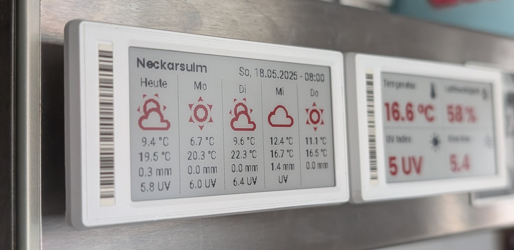
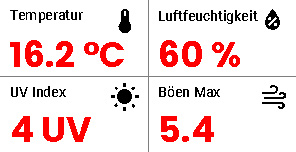
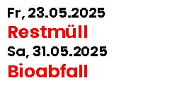
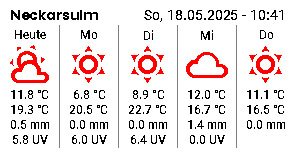
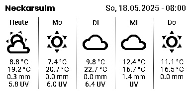

# OpenEPaperLink Home Assistant Templates
Here you can find my templates for the Electronic Shelf Labels powered by [OpenEPaperLink](https://openepaperlink.org/) and the [Home Assistant integration](https://github.com/OpenEPaperLink/Home_Assistant_Integration/blob/main/docs/drawcustom/supported_types.md#download-image).

All templates are in the `templates` folder. You can use them as a starting point and modify them to fit your needs.

The templates need to be adjusted by the target device id of the OpenEPaperLink device and the source entities you want to display.

| Type             | Resolution | Preview                                                                 | Requirements                                                                                                                                                                                                                                           |
|------------------|------------|-------------------------------------------------------------------------|--------------------------------------------------------------------------------------------------------------------------------------------------------------------------------------------------------------------------------------------------------|
| 4 Sensor Grid    | 296x152    |        |                                                                                                                                                                                                                                                        |
| Trash Calendar   | 250x128    |      | [Home Assistant Local Calendar](https://www.home-assistant.io/integrations/local_calendar/) with either manually filled data or automatically by for example [HACS Waste Calendar Schedule](https://github.com/mampfes/hacs_waste_collection_schedule) |
| Weather Forecast | 296x152    |  | [Home Assistant Weather](https://www.home-assistant.io/integrations/weather/])                                                                                                                                                                         |
| Weather Forecast | 384x184    |  | [Home Assistant Weather](https://www.home-assistant.io/integrations/weather/])                                                                                                                                                                         |

Feel free to open a merge request to add new templates or open an issue to ask for new ones with a specific idea.